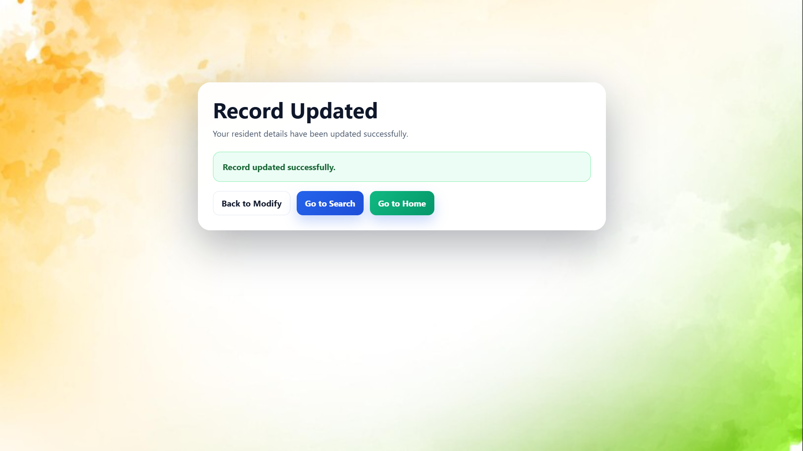
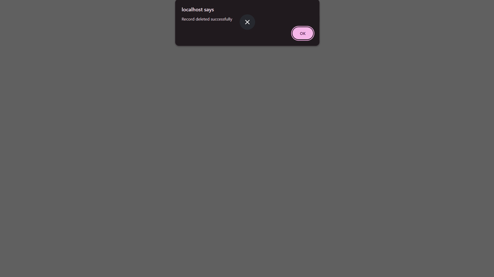

# GS Assignment

	<strong>Gramasevaka office record management system</strong> 
	A simple PHP and HTML based web app for registration, search, update, and delete workflows.

	

## Overview

This project provides a small government-style record management interface with separate pages for creating, searching, modifying, and deleting records. The README below is focused on the visual presentation of the app and the main user flows.

## Pages

<table>
	<tr>
		<td width="50%" valign="top">
			<h3>Home page</h3>
			
		</td>
		<td width="50%" valign="top">
			<h3>Registration page</h3>
			
		</td>
	</tr>
	<tr>
		<td width="50%" valign="top">
			<h3>Search page</h3>
			
		</td>
		<td width="50%" valign="top">
			<h3>Search result page</h3>
			
		</td>
	</tr>
	<tr>
		<td width="50%" valign="top">
			<h3>Modification page</h3>
			
		</td>
		<td width="50%" valign="top">
			<h3>Record update</h3>
			
		</td>
	</tr>
	<tr>
		<td width="50%" valign="top">
			<h3>Delete message</h3>
			
		</td>
		<td width="50%" valign="top">
			<h3>No result screen</h3>
			
		</td>
	</tr>
</table>

## Main Flow

1. Open the home page.
2. Register a new record.
3. Search for an existing entry.
4. Modify or update the selected record.
5. Delete a record when needed.

## Project Structure

- `index.html` - main landing page
- `Registration.php` and `Registration2.php` - registration flow
- `search.php` and `search_resulr.php` - search flow
- `modify.php` and `modify_process.php` - update flow
- `delete.php` - delete action
- `login.php` and `ok.php` - supporting pages
- `index.css` and `script.js` - styling and client-side behavior

## Notes

This README is intentionally designed as a clean visual showcase for the existing pages in the application.
